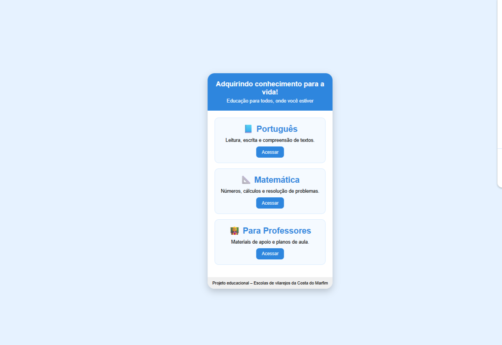

🌍 Présentation du projet

Acquérir des connaissances pour la vie ! (Adquirindo conhecimento para a vida!) est une interface simple d’application éducative développée en HTML et CSS.

L’objectif de ce projet est de simuler une plateforme d’apprentissage destinée aux enseignants travaillant dans des villages isolés, avec un accès limité aux ressources éducatives et aux technologies, afin de les aider à enseigner des matières de base dans des régions reculées.

L’interface a été conçue pour être simple, intuitive et accessible, permettant à des enseignants ayant peu d’expérience en informatique de l’utiliser facilement.

🎯 Objectifs du projet
Soutenir les enseignants dans les zones rurales ou isolées
Fournir un accès à des ressources éducatives de base
Encourager l’intérêt des enfants pour l’éducation
Montrer comment une technologie simple peut soutenir l’apprentissage
🖥️ Interface de l’application

(Vous pouvez garder votre image telle quelle)

⚙️ Technologies utilisées
HTML5 – Structure de l’application
CSS3 – Mise en page et design
Visual Studio Code – Environnement de développement
✨ Fonctionnalités
Interface simple et épurée
Sections éducatives pour :
Portugais
Mathématiques
Espace d’accompagnement pour les enseignants
Design inspiré du mobile
Navigation facile
📁 Structure du projet
project-folder
│
├── index.html
├── style.css
└── README.md
