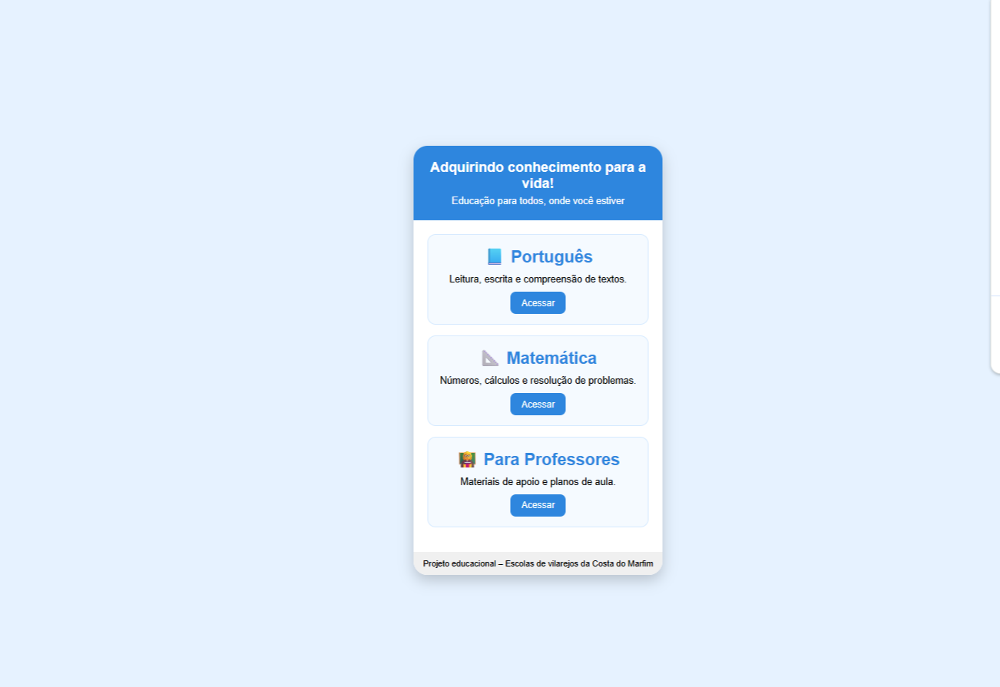

# 🌍 Project Overview

*Acquérir des connaissances pour la vie! (Acquiring knowledge for life!)* is a simple educational application interface developed using **HTML and CSS** (complete project with methodology in `Project_End.pdf`).

The goal of this project is to simulate a learning platform designed for teachers working in isolated villages, where access to educational resources and technology is limited. It aims to help them teach basic subjects in remote areas.

The interface was designed to be **simple, intuitive, and accessible**, allowing teachers with little or no computer experience to use it easily.

---

# 🎯 Project Goals

- Support teachers in rural or remote areas  
- Provide access to basic educational resources  
- Encourage children’s interest in education  
- Demonstrate how simple technology can support learning  

---

# 🖥️ Application Interface



---

# ⚙️ Technologies Used

- HTML5 – Application structure  
- CSS3 – Layout and design  
- Visual Studio Code – Development environment  

---

# ✨ Features

- Clean and simple interface  
- Educational sections including:
  - Portuguese
  - Mathematics  
- Teacher support area  
- Mobile-inspired design  
- Easy navigation  

---

# 📁 Project Structure

```
project-folder/
│
├── index.html
├── style.css
└── README.md
```
